# PhantomDrive

PhantomDrive is a Qt 6 desktop racing game built around arcade racing, traffic-rule training, custom track creation, two-player racing, and AI-assisted driving reports.

The current Windows delivery entry point is `../PhantomDrive_Windows_Release/PhantomDrive.exe`. The source entry point is `CMakeLists.txt`. End-user launch instructions are in `../PhantomDrive_Windows_Release/README.md`.

## Project Overview

PhantomDrive combines a 2D top-down racing renderer, a data-driven vehicle simulation loop, AI opponents, power-ups, traffic-rule scoring, and a post-drive coach report UI. The application is designed for classroom demos and final delivery packaging on Windows.

The main runtime flow is:

```text
MainWindow
  -> GameViewWidget
  -> ArcadeHUD
  -> VehiclePhysics / DrivingDataCollector
  -> ArcadeMode / LearningMode / CustomTrackMode
  -> AIOpponentManager
  -> TrafficObjectManager
  -> ScoreManager / AIAPIClient / DrivingReportWidget
```

The vehicle model is data-driven: movement state is maintained by `VehiclePhysics`, sampled by `VehicleSensor`, rendered by `GameViewWidget`, and evaluated by the scoring/report modules.

## Key Features

### Arcade Mode

- Built-in race setup with track selection, player count, and AI difficulty.
- Lap timing, checkpoint progress, ranking, race banners, and right-side Arcade HUD.
- AI opponents with configurable Easy, Medium, Hard, and Adaptive AI settings.
- Power-up boxes, visual effects, countdown audio, lap objectives, and finish flow.

### Learning Mode

- Traffic-rule practice mode focused on safe driving.
- Speed limits, traffic lights, pedestrian crossing events, safe-driving feedback, and violation collection.
- Uses the same modern HUD and report pipeline as the race modes.

### Custom Track Mode

- In-app 24 x 18 tile editor.
- Brushes: Road, Grass, Wall, Start, Finish, CP, Item, and Erase.
- Editor run settings for Single Player or Two-Player, plus Easy, Normal, Hard, or Adaptive AI.
- Save/load/export support through the track I/O layer.
- Runtime conversion from editor grid coordinates to the driving engine snapshot.

### Two-Player Race

- Dedicated main-menu entry for two-player race sessions.
- Independent pre-race circuit and AI difficulty selection; choices do not affect Arcade or Learning maps.
- P1 and P2 are shown with distinct vehicle colors and HUD state.
- Finish flow waits for both players before ending the session.
- Reports can show player-specific score and AI coach content.

### Adaptive AI Demo

- Main-menu entry that starts an Arcade session with adaptive AI difficulty enabled.
- AI adaptation uses Q-learning style feedback from score reports, including safety risk, rule compliance, reward, and terminal penalty.

### Power-ups

Implemented power-up types include Boost, Shield, Missile, Oil Slick, EMP, Invisibility, Repair, Teleport, Magnet, and Random/Custom. The release assets include power-up icons, 321GO countdown sounds, and differentiated power-up audio.

### Traffic Rules

- Traffic light states and red-light feedback.
- Speed-limit signs and nearest supported sign rendering.
- Pedestrian crossing zones.
- Mode-specific scoring: Learning treats speeding as a traffic-rule violation; race-style modes focus more on racing, collisions, wrong-way behavior, smoothness, and efficiency.

### AI Coach Report / DeepSeek API

- `ScoreManager` generates score reports and async AI coach markdown.
- `AIAPIClient` reads environment variables for DeepSeek and optional Zhipu/GLM.
- Default DeepSeek model: `deepseek-v4-flash`.
- If no usable API key is configured, or the API request fails, the app falls back to a local mock coach report.
- Real API keys must never be committed or documented in screenshots.

docs/images/readme## Build Requirements

- Windows 10/11
- CMake 3.20 or newer
- C++17 compiler
- Qt 6.8 or compatible Qt 6 kit with:
  - Core
  - Gui
  - Widgets
  - OpenGL
  - Network
  - Charts
  - Xml
  - Multimedia
- OpenGL runtime support

The current local release package was built with Qt 6.8.3 MinGW 64-bit.

## Screenshots

The README displays all 14 screenshots as lightweight thumbnails for stable GitHub rendering. Click any image to open the original full-size screenshot.

### PhantomDrive Main Menu

[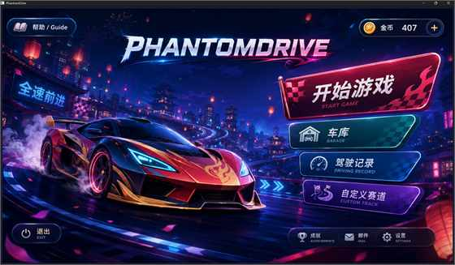](docs/images/readme/main-menu-2026-07.png)

### Game Mode Selection

[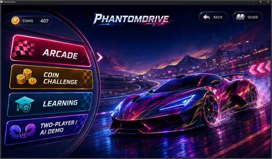](docs/images/readme/mode-select-2026-07.png)

### Race Setup

[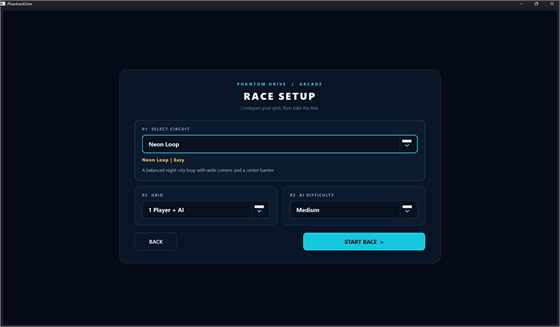](docs/images/readme/race-setup-2026-07.png)

### Coin Challenge HUD

[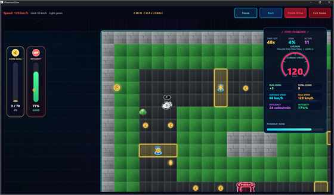](docs/images/readme/coin-challenge-hud.png)

### Balloon Rush Intro

[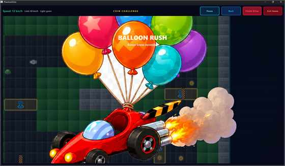](docs/images/readme/balloon-rush-intro.png)

### Balloon Rush Gameplay

[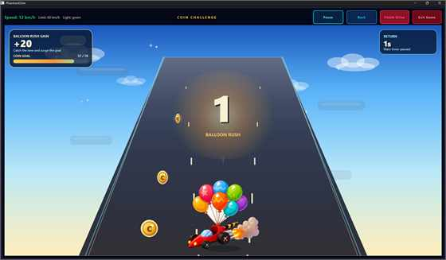](docs/images/readme/balloon-rush-gameplay.png)

### Coin Challenge Results

[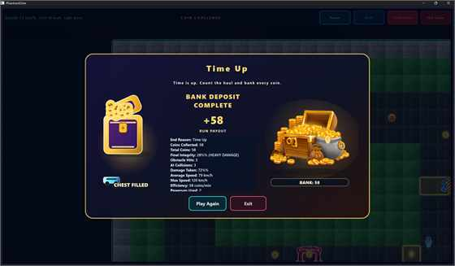](docs/images/readme/coin-challenge-results.png)

### Arcade Mode

[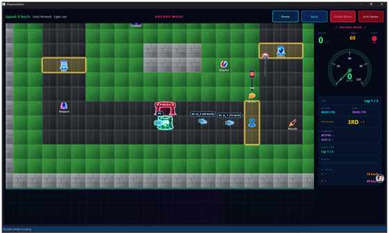](docs/images/readme/arcade-mode.png)

### Learning Mode

[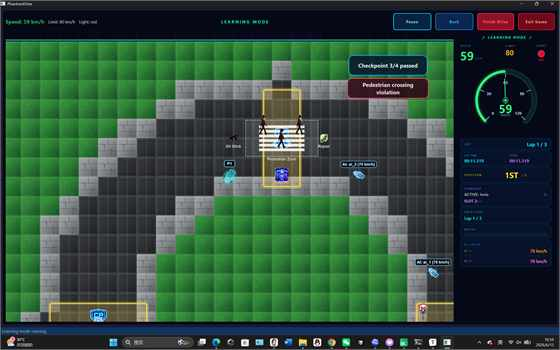](docs/images/readme/learning-mode.png)

### Custom Track Editor

[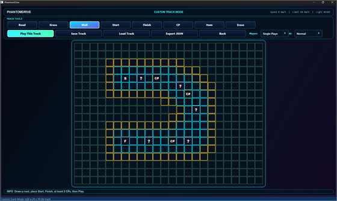](docs/images/readme/custom-track-editor.png)

### Custom Track Race

[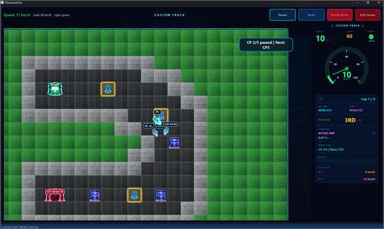](docs/images/readme/custom-track-race.png)

### Two-Player HUD

[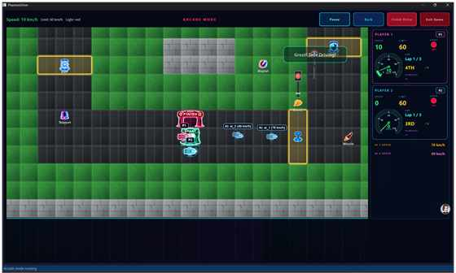](docs/images/readme/two-player-hud.png)

### AI Coach Report

[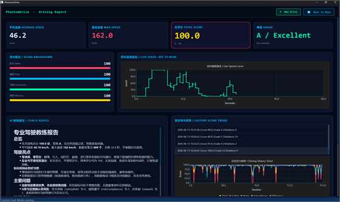](docs/images/readme/ai-coach-report.png)

### Windows Release Launcher

[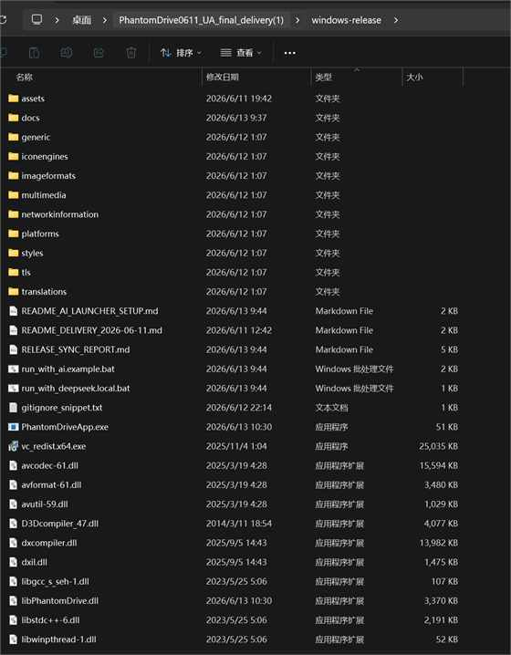](docs/images/readme/windows-release-launcher.png)

## Build from Source

From the repository root:

```powershell
cmake -S source -B source/build-release -G "MinGW Makefiles" `
  -DCMAKE_BUILD_TYPE=Release `
  -DCMAKE_PREFIX_PATH=C:\Qt\6.8.3\mingw_64

cmake --build source/build-release --config Release --target PhantomDriveApp
```

If your Qt or compiler path differs, adjust `CMAKE_PREFIX_PATH` and ensure the compiler is available on `PATH`.

The app target is:

```text
PhantomDriveApp
```

By default, test and demo targets are disabled. Enable them with:

```powershell
-DPHANTOMDRIVE_BUILD_TESTS=ON
```

## Run Windows Release

Use the packaged Windows release directory:

```text
../PhantomDrive_Windows_Release/PhantomDrive.exe
```

Run it from inside `PhantomDrive_Windows_Release` so the executable can find:

- `assets/`
- Qt DLLs
- `platforms/qwindows.dll`
- `imageformats/`
- `styles/`
- `multimedia/`
- `translations/`

The release package includes an end-user `README.md` and the safe optional
`run_with_ai.example.bat` template. Do not place real API keys or private local
launcher files in the submitted package.

## DeepSeek API Setup

The safe template is:

```text
../PhantomDrive_Windows_Release/run_with_ai.example.bat
```

Copy it to a local file:

```text
../PhantomDrive_Windows_Release/run_with_deepseek.local.bat
```

Then set your key only in the local file:

```bat
set PHANTOMDRIVE_AI_MODE=deepseek
set PHANTOMDRIVE_AI_TIMEOUT_MS=30000
set DEEPSEEK_API_KEY=PASTE_YOUR_REAL_DEEPSEEK_API_KEY_HERE
set DEEPSEEK_BASE_URL=https://api.deepseek.com
set DEEPSEEK_MODEL=deepseek-v4-flash
```

Notes:

- Do not append `/chat/completions` to `DEEPSEEK_BASE_URL`; the code normalizes the endpoint.
- Do not commit real API keys.
- The app logs whether a key is present, but it does not print the key value.
- If DeepSeek fails or no key is configured, the report UI uses a local fallback report.
- A screenshot of an AI report must not be treated as proof of a successful live API call unless the run logs confirm it.

## Project Structure

```text
source/
  CMakeLists.txt
  assets/
    mainwindow.ui
    sounds/
    visual_upgrade/
  docs/
    images/readme/
  include/PhantomDrive/
    core/
    gamemode/
    scoring/
    track/
    UI/
    physics/
  packaging/
    package.sh
    windows/phantomdrive.nsi
  src/
    core/
    gamemode/
    scoring/
    track/
    UI/
    physics/
  tests/

PhantomDrive_Windows_Release/
  PhantomDrive.exe
  libPhantomDrive.dll
  assets/
  docs/
  platforms/
  imageformats/
  styles/
  multimedia/
```

## Team / Module Responsibilities

| Area | Main Files | Responsibility |
|------|------------|----------------|
| Application shell | `src/UI/mainwindow.cpp`, `assets/mainwindow.ui` | Main menu, mode entry, setup pages, session flow |
| Rendering | `src/UI/GameViewWidget.cpp` | Track, vehicles, power-ups, traffic objects, visual assets |
| HUD and feedback | `src/UI/ArcadeHUD.cpp`, `src/UI/InteractiveFeedback.cpp` | Speedometer, countdown, banners, race status |
| Custom track editor | `src/UI/CustomTrackEditorWidget.cpp` | Tile editor, brush controls, player/AI run settings |
| Game modes | `src/gamemode/` | Arcade, Learning, Custom Track, power-up runtime, AI opponents |
| Track data | `src/track/`, `include/PhantomDrive/track/` | Built-in tracks, custom track data, validation, I/O |
| Vehicle loop | `src/core/VehiclePhysics.cpp`, `src/core/GameEngine.cpp` | Data-driven vehicle state and simulation support |
| Scoring | `src/scoring/DrivingScoreCalculator.cpp`, `src/scoring/ScoreManager.cpp` | Score formula, violations, report generation |
| AI API | `src/scoring/AIAPIClient.cpp` | DeepSeek/Zhipu config, request handling, local fallback |
| Report UI | `src/UI/DrivingReportWidget.cpp` | Score cards, charts, history, AI coach markdown |
| Packaging | `source/packaging/`, `PhantomDrive_Windows_Release/` | Windows release assets and deployment |

## Demo Checklist

Use this checklist for a live demo or final acceptance pass:

1. Launch `../PhantomDrive_Windows_Release/PhantomDrive.exe`.
2. Confirm the main menu background, title, and entries are visible.
3. Enter Arcade Mode through Race Setup and confirm countdown, HUD, AI cars, checkpoints, power-ups, lap/time, and ranking.
4. Enter Learning Mode and confirm speed limit, traffic light state, safety feedback, and report generation.
5. Enter Custom Track Mode, draw a playable route with Start, Finish, at least two CP tiles, and Item tiles.
6. Start Custom Track Race and confirm the route, objective text, checkpoints, AI cars, and HUD update.
7. Enter Two-Player Race and confirm P1/P2 controls, HUD, and finish behavior.
8. Enter Adaptive AI Demo and confirm it starts an Arcade-style session with adaptive AI selected.
9. Finish a session and open Driving Report / History.
10. Confirm score cards, score breakdown, live speed chart, history trend, violations, and AI coach markdown.
11. If testing DeepSeek, launch from the local `.bat` file and verify the model is `deepseek-v4-flash`.
12. Confirm no real API key appears in README, screenshots, logs shared for delivery, or committed files.

## Current Documentation Notes

- `source/docs/` is intentionally a flat documentation directory except for image assets under `source/docs/images/readme/`.
- `source/packaging/` is the formal packaging directory.
- Root delivery notes may be copied into `PhantomDrive_Windows_Release`, but build directories, zip archives, and source trees should not be copied into the release package.
