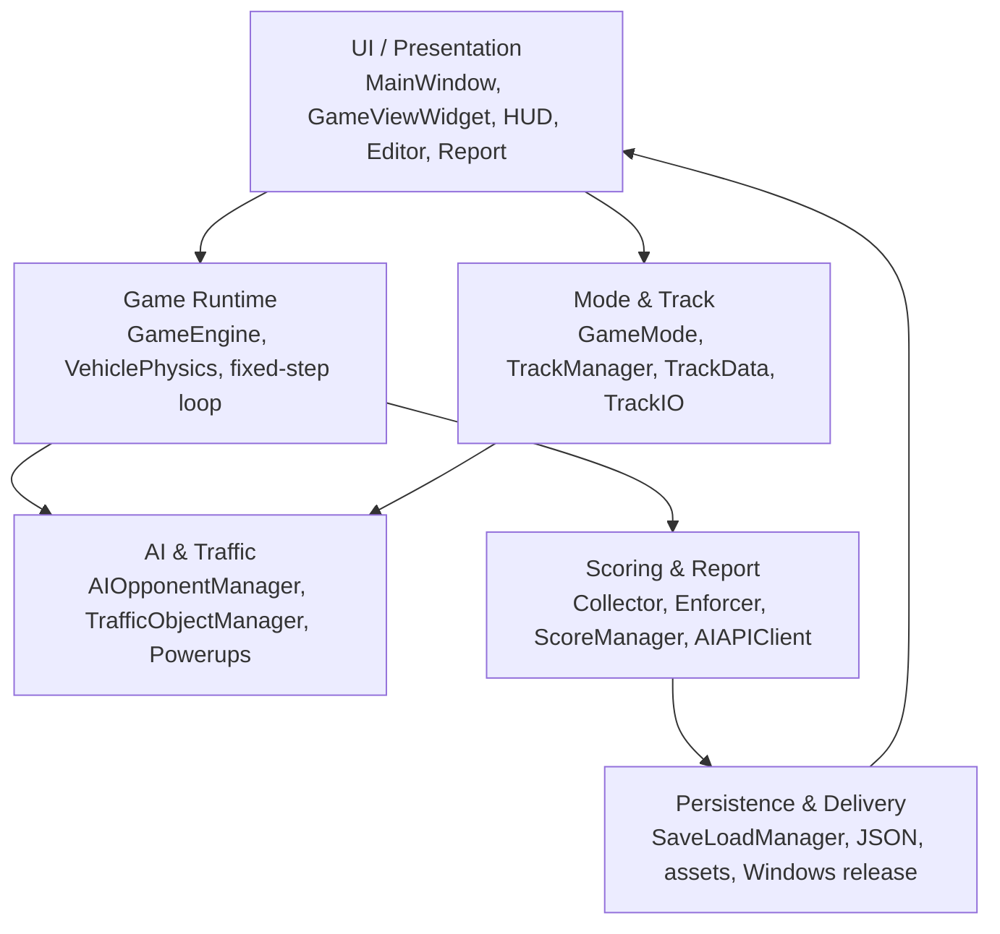
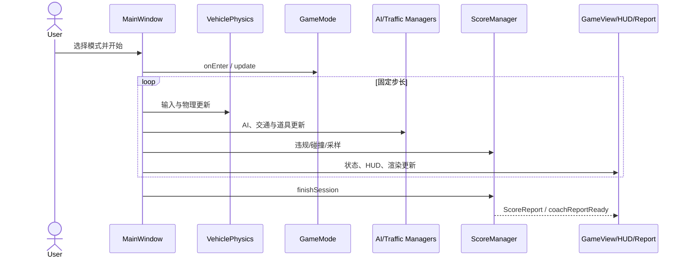
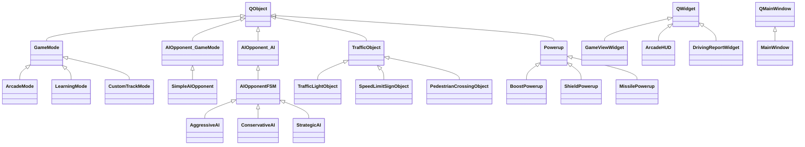

# PhantomDrive Final Report Code Audit Material

> 审计日期：2026-07-09  
> 审计对象：`source/` Qt/CMake 工程、根目录与 `source/README.md`、`source/docs/`、`source/tests/`、`source/packaging/`、`PhantomDrive_Windows_Release/`。  
> 说明：本文是基于仓库现状的 final report 素材，不是最终报告。凡 README 声明与实物不一致之处，以代码和目录实物为准。

## 0. 审计摘要

1. PhantomDrive 已实现一个 Qt 6 桌面俯视角赛车应用，覆盖 Arcade、Learning、Custom Track、Two-Player、Adaptive AI Demo、Coin Challenge、车库/皮肤、赛后报告与历史记录。
2. 工程具备完整的 CMake 构建入口、共享库 `PhantomDrive`、应用目标 `PhantomDriveApp`、资源复制规则和可选测试目标。
3. 按课程指定的严格 C++ 后缀口径（`.h/.hpp/.cpp/.cc/.cxx`）统计为 **54,049 物理行**；加上工程实际大量使用的 `.hh` 头文件为 **64,059 行**，远高于 2,000 行要求。
4. 排除内嵌 `physics/contrib` 后，正则静态扫描得到 **183 个唯一 class 名、76 个唯一 struct 名、36 个唯一 enum 名**。该数字包括项目集成的 MiniCore 物理模块；核心业务自定义类仍显著多于 5 个。
5. 扫描到约 33 个直接继承 `QObject` 的类、19 个直接继承 `QWidget/QMainWindow/QAbstractButton` 的 UI 类；这些是直接继承计数，不含间接派生。
6. 明确存在多条两层以上继承链，例如 `QObject → GameMode → ArcadeMode/LearningMode/CustomTrackMode`、`QObject → AIOpponent → AIOpponentFSM → AggressiveAI`、`QObject → TrafficObject → TrafficLightObject`，满足课程的 inheritance hierarchy 要求。
7. 抽象接口和运行时多态证据充分：`GameMode`、两个 `AIOpponent` 接口、`IDrivingDataCollector`、`Powerup` 和多个 MiniCore 抽象基类均有纯虚函数；派生类大量使用 `override`。
8. UI 要求被完整满足：`.ui` 页面栈加代码构造页面，包含主菜单、比赛设置、游戏画面、HUD、自定义赛道编辑器、车库、报告、历史图表、暂停/结束与挑战结算覆盖层。
9. 文件处理覆盖写入、读取和更新：`SaveLoadManager` 对历史报告 JSON 执行新增、加载、删除、索引更新及异步 AI 文本回写；`TrackIO` 保存/加载赛道；`DrivingDataStorage` 保存/加载驾驶数据；`PlayerProfileStore` 保存/加载档案。
10. 这些操作属于**结构化 JSON 文档式更新**，不是定长记录的字节偏移随机访问。final report 应如实表述为“通过结构化 JSON 文件完成写入、读取和更新，是数据保存与更新的工程实现”。
11. AI 教练支持 `auto/mock/deepseek/zhipu` 配置、异步结果信号、超时和本地 fallback；没有 API Key 时仍可生成可展示报告，体现 graceful degradation。
12. `source/tests/` 有主窗口、键盘输入和可视化测试/演示源文件，CMake 以 `PHANTOMDRIVE_BUILD_TESTS` 控制；当前 release-ui 缓存中该选项为 OFF，仓库未提供自动化测试结果日志。
13. 发布目录实物包含 `PhantomDrive.exe`、`libPhantomDrive.dll`、Qt 6 DLL、平台/图片/多媒体插件与 assets；release README 已统一为实际目录/EXE 名，并在顶部提供 Quick Start、控制键和故障排查。
14. 2026-07-09 的增量构建核验识别到 Qt 6.8.3、MinGW 13.1、Release/C++17，但编译在 `AIAPIClient.cpp` 目标处以无诊断的 make Error 1 退出，因此不能把本次审计写成“干净重编译通过”；发布包和旧 build 可执行文件存在。
15. 最适合进入 final report 的亮点是：模式基类多态、AI 接口层次、交通对象多态、数据驱动车辆状态、Qt 信号槽事件流、JSON 持久化、双人 HUD、赛道编辑器、异步 AI 教练与 fallback。

## 1. 项目实际完成内容总览

### 1.1 E-A / 引擎基础层

- **实际完成**：`GameEngine` 组织赛道、传感器、碰撞、AI 与渲染；`VehiclePhysics` 保存位置、速度、加速度、转角、boost 和比赛进度；`GameViewWidget` 绘制赛道、车辆、交通设施、道具和视觉反馈。
- **核心类/文件**：`include/PhantomDrive/core/GameEngine.h`、`src/core/GameEngine.cpp`、`include/PhantomDrive/core/VehiclePhysics.h`、`src/core/VehiclePhysics.cpp`、`include/PhantomDrive/UI/GameViewWidget.h`、`src/UI/GameViewWidget.cpp`。
- **模块对接**：状态由 `VehicleSensor`/`DrivingDataCollector` 采样，交给模式、评分和 HUD；赛道由 `TrackManager` 提供；视图通过 slots 接收车辆、AI、交通灯等更新。
- **report 可写重点**：数据驱动模拟循环；物理状态、采样、渲染、评分职责分离；固定步长主循环由 `MainWindow` 驱动。
- **证据**：`src/UI/mainwindow.cpp:5616-5924`、`src/core/GameEngine.cpp:204-259`、`src/core/VehiclePhysics.cpp`。

### 1.2 E-B / 模式与扩展层

- **实际完成**：抽象 `GameMode` 与 Arcade/Learning/CustomTrack 派生模式；模式管理和过渡；24×18 自定义赛道编辑、校验、保存、加载、导出和运行；交通灯、限速牌、行人过街；道具箱与十类道具语义。
- **核心类/文件**：`gamemode/GameMode.*`、`GameModeManager.*`、`ArcadeMode.*`、`LearningMode.*`、`CustomTrackMode.*`、`TrafficObject*`、`Powerup*`，以及 `track/TrackIO.*`、`TrackValidator.*`。
- **模块对接**：`MainWindow` 创建/切换模式；编辑器通过 signals 请求保存、加载、导出、运行；`TrackIO` 将 `TrackData` 与 JSON 转换；交通对象把违规事件送入学习/评分路径。
- **report 可写重点**：Strategy-like 模式设计、交通对象基类多态、自定义赛道从编辑模型到运行快照的数据转换。
- **证据**：`include/PhantomDrive/gamemode/GameMode.h`、`src/UI/mainwindow.cpp:2250-2289,3301-3490,4621-4800`。

### 1.3 A-A / AI 对手与自适应 AI

- **实际完成**：游戏运行侧使用抽象 `gamemode/AIOpponent` 与 `SimpleAIOpponent`，支持 waypoint、状态、转向/油门/制动、比赛进度、道具、序列化；`AIOpponentManager` 负责创建、销毁、更新、排名与 Q-learning 反馈。
- **另一套 AI 层次**：`ai/AIOpponent → AIOpponentFSM → AggressiveAI/ConservativeAI/StrategicAI` 展示 FSM/策略派生层次。需注意它与 `gamemode/AIOpponent` 同名但属于不同头文件，report 中必须明确命名空间/路径，避免混淆。
- **自适应证据**：`ScoreReport::QLearningFeedback` 包含 reward、风险、规则遵从和 terminal penalty；`AIOpponentManager::onQLearningFeedbackReady` 接收反馈。
- **report 可写重点**：接口与实现分离、基类指针容器、waypoint 导航、难度参数和赛后反馈闭环。
- **代码中未完全确认**：仓库使用“Q-learning style feedback”与调参接口，但未见完整的 Q-table 持久化训练器；不应宣称实现了完整强化学习算法。
- **证据**：`include/PhantomDrive/gamemode/AIOpponent.h`、`SimpleAIOpponent.h`、`src/gamemode/AIOpponentManager.cpp:620`、`include/PhantomDrive/scoring/ScoreReport.h`。

### 1.4 A-B / 评分与 AI 教练报告

- **实际完成**：`TrafficRuleEnforcer` 和采集器产生违规；`ScoreManager::recordViolation/recordCollision` 汇集事件；`DrivingScoreCalculator` 计算 breakdown；`finishSession` 形成 `ScoreReport`；随后异步生成教练 Markdown。
- **核心类/文件**：`ScoreManager.*`、`DrivingScoreCalculator.*`、`ScoreReport.*`、`TrafficRuleEnforcer.*`、`AIAPIClient.*`、`ViolationConfig.h`。
- **模块对接**：报告先保存到 `SaveLoadManager`；`coachReportReadyForVehicle` 到达后按 `sessionId + vehicleId` 回写历史，支持双人报告分离。
- **fallback**：AI 客户端读取 DeepSeek/Zhipu 配置；mock 模式或调用失败时生成本地建议，并在 Markdown 中说明 fallback 原因。
- **report 可写重点**：从事实事件到 DTO 报告再到 UI 的流水线；外部服务故障不会阻断核心功能。
- **证据**：`src/scoring/ScoreManager.cpp:127-224`、`src/scoring/AIAPIClient.cpp:108-119,320-383,460`、`src/UI/mainwindow.cpp:2125-2148,6173-6178`。

### 1.5 U-A / 主界面整合层

- **实际完成**：`MainWindow` 统筹 `QStackedWidget` 页面、主菜单、比赛设置、模式启动、暂停/恢复/结束、报告入口、自定义赛道、车库、AI 难度和双人入口。
- **核心类/文件**：`include/PhantomDrive/UI/mainwindow.h`、`src/UI/mainwindow.cpp`、`assets/mainwindow.ui`、`MainMenuWidget.*`、`StartGameOverlay.*`。
- **模块对接**：连接编辑器、引擎、HUD、评分器、持久化和声音管理器；负责将游戏 tick 的状态广播到多个显示和规则模块。
- **report 可写重点**：页面栈管理与信号槽解耦；一个清晰的用户旅程：菜单 → 设置 → 游戏 → 结算/报告 → 历史。
- **证据**：`src/UI/mainwindow.cpp:1982-2001,2301-2341,2532-2547,5957-6208`。

### 1.6 U-B / HUD 与展示层

- **实际完成**：`ArcadeHUD` 展示速度、圈数、计时、排名、AI、限速、交通灯、道具及双人状态；`LearningHUD` 显示学习信息；`InteractiveFeedback` 显示即时反馈；报告页含分数拆解、违规表、实时速度、历史趋势和 AI Markdown。
- **核心类/文件**：`ArcadeHUD.*`、`learninghud.*`、`InteractiveFeedback.*`、`DrivingReportWidget.*`、`DrivingHistoryChartWidget.*`、`SoundManager.*`、`SoundGenerator.*`、`ThemeManager.h`。
- **模块对接**：HUD 从主循环与 `GameEngine` slots 更新；报告从 `ScoreReport` 与 `SaveLoadManager` 更新；声音按 UI/碰撞/倒计时/道具事件播放。
- **report 可写重点**：观察者式 UI 更新、双人分区 HUD、图表化历史、视觉/声音反馈带来的易用性。
- **证据**：`src/UI/mainwindow.cpp:5050-5155`、`src/UI/DrivingReportWidget.cpp:1291-1301`、`include/PhantomDrive/UI/ArcadeHUD.h`。

## 2. 课程要求符合度检查表

| 课程要求 | 代码证据 | 是否满足 | final report 建议写法 |
|---|---|---:|---|
| class / object | 183 个唯一 class 名（排除 contrib）；运行时广泛 `new`/父子对象管理 | 是 | 选 10–15 个核心类展示职责，不必罗列全部 |
| encapsulation | `VehiclePhysics`、`ScoreManager`、`TrackData`、`AIOpponentManager` 等私有状态+公开接口 | 是 | 说明状态只能通过语义方法修改并发出事件 |
| inheritance | GameMode、AI、TrafficObject、Powerup、Qt Widgets、MiniCore 层次 | 是 | 用 3 棵最贴近业务的继承树 |
| polymorphism | 纯虚函数、`override`、基类指针、Qt signal-slot、事件重写 | 是 | 区分运行时虚函数多态与事件驱动解耦 |
| class 数量 ≥ 5 | 核心业务类即远超 5 | 是 | 给出审计口径与核心类表 |
| inheritance hierarchy ≥ 2 层 | `QObject→GameMode→ArcadeMode`；`QObject→AIOpponent→AIOpponentFSM→AggressiveAI` | 是 | “基类到派生类”算一层时也达到至少 2 层 |
| UI is needed | Qt Widgets、`.ui`、QStackedWidget、自绘控件、图表、编辑器 | 是 | 配合 README 的 8 张截图说明页面覆盖 |
| random file processing：写/读/更新 | 报告历史、赛道、驾驶数据、玩家档案 JSON | 工程意义满足 | 如实说明是 JSON 文档式更新，不宣称字节级 random access |
| source code ≥ 2000 行 | 严格口径 54,049 行 | 是 | 附统计命令、后缀和排除规则 |
| 注释情况 | 严格 C++ 后缀启发式约 1,887 个纯注释行；`.hh` 另约 3,120 行 | 有，但分布不均 | 说明统计不含行尾注释，主 UI `.cpp` 注释率偏低 |
| 合理性 | 分层模块、DTO、管理器、验证器、fallback | 基本满足 | 同时承认 MainWindow 过大、双 AI 接口同名是维护风险 |
| 效率 | 固定步长更新、对象管理器、异步网络请求 | 基本满足 | 不宣称经过性能基准；可写“避免阻塞 UI” |
| 友好性 | 页面流、HUD、即时反馈、声音、错误对话框、fallback | 是 | 用任务流和截图证明 |
| executable / release | 实物 `PhantomDrive_Windows_Release/PhantomDrive.exe` 与依赖齐全 | 有条件满足 | 先修正文档命名不一致，再作为交付证据 |

## 3. 技术路线

### 3.1 运行环境

| 项目 | 实际配置 | 证据文件 | final report 写法 |
|---|---|---|---|
| 操作系统 | 目标 Windows 10/11；当前交付为 Windows | `README.md`、发布目录 | “面向 Windows 10/11 的 Qt 6 桌面应用” |
| Qt | CMake 要求 Qt 6；本地缓存为 6.8.3 MinGW 64-bit | `CMakeLists.txt`、`build/release-ui/CMakeCache.txt` | 列 Core/Gui/Widgets/OpenGL/Network/Charts/Xml/Multimedia |
| C++ | C++17，required | `CMakeLists.txt:7-8` | “统一采用 C++17” |
| CMake | 最低 3.20 | `CMakeLists.txt:1` | 给出 configure/build 命令 |
| 工具链 | MinGW 13.1 64-bit | `build/release-ui/CMakeCache.txt` | “Qt 6.8.3 + MinGW 13.1” |
| 第三方依赖 | Qt 6、OpenGL；内嵌 MiniCore/GLM/GLEW 兼容代码 | `CMakeLists.txt`、`include/PhantomDrive/physics` | 区分系统包和随源码集成模块 |
| 资源路径 | build 后复制 `source/assets` 到 EXE 同目录 `assets` | `CMakeLists.txt` POST_BUILD | 解释相对资源和 release assets |
| AI 环境变量 | `PHANTOMDRIVE_AI_MODE/TIMEOUT_MS`、DeepSeek key/base/model、Zhipu key/base/model | `src/scoring/AIAPIClient.cpp:108-119` | API Key 只从环境读取 |
| 默认模型 | DeepSeek `deepseek-v4-flash`；Zhipu `glm-4.7-flash` | 同上 | 默认值应写“代码默认”，不暗示在线调用成功 |
| Windows 运行 | 实物应从 `PhantomDrive_Windows_Release/PhantomDrive.exe` 启动 | 发布目录 | README 当前名称需同步 |

### 3.2 总体设计

#### 分层架构



#### 核心模块协作



#### 数据流

```text
键盘/菜单输入
  → MainWindow 固定步长循环
  → VehiclePhysics / AI / Traffic / Powerup 状态
  → VehicleSensor + DrivingDataCollector
  → TrafficRuleEnforcer + ScoreManager
  → ScoreReport + QLearningFeedback
  → SaveLoadManager(JSON) + AIAPIClient
  → DrivingReportWidget / History / AIOpponentManager
```

#### 信号槽与事件流

- `GameEngine::speedDataReady/lapDataReady/modeDataReady` 连接到 `LearningHUD` 更新 slots。
- 编辑器发出 `playRequested/saveRequested/loadRequested/exportJsonRequested/backRequested`，`MainWindow` 负责业务操作。
- `ScoreManager::coachReportReadyForVehicle` 携带 vehicle/session 标识，UI 显示且持久化层回写。
- `TrafficObject`、`Powerup`、`VehicleSensor` 与管理器使用 signals 报告状态变化，调用方不必轮询所有细节。
- **解决问题**：降低 UI、运行时和数据服务的直接耦合。
- **可写句子**：“系统利用 Qt signal-slot 将高频状态更新、用户操作和异步网络结果统一成事件流。”

#### 模式切换

```text
Main Menu
  → Race Setup / Learning / Custom Editor / Garage
  → MainWindow::startGame 或 startCustomTrackSession
  → GameModeManager / 对应 GameMode::onEnter
  → QStackedWidget 游戏页
  → pause/resume
  → finishSession
  → Report Page
  → Main Menu / Replay
```

#### 基于事实的设计判断

| 设计点 | 代码证据 | 解决的问题 | final report 可写句子 |
|---|---|---|---|
| layered/modular | `include/src` 按 core/gamemode/track/scoring/UI 分区 | 控制复杂度 | “按运行、模式、AI、评分、展示、持久化分层” |
| event-driven | 各 QObject 的 signals/slots | 异步与解耦 | “UI 与业务通过事件连接” |
| strategy-like mode | `GameMode` 派生类 | 统一模式生命周期 | “模式共享接口、按场景替换行为” |
| state management | `ModeState`、`AIState`、`CustomTrackModeState` | 控制合法流程 | “显式状态避免散落布尔逻辑” |
| observer-like UI | HUD/Report slots | 一份状态多处展示 | “状态变化主动推送到视图” |
| JSON persistence | SaveLoad/TrackIO/Profile/DrivingData | 可读、可扩展数据 | “DTO 与 JSON 双向转换” |
| fallback | AIAPIClient mock/local report | 无网络仍可交付 | “外部 AI 是增强项而非单点故障” |

### 3.3 详细设计

#### 3.3.1 Game Engine / Vehicle Physics / Track Rendering

- **职责**：引擎编排、车辆运动状态、赛道进度、碰撞对接、画面渲染。
- **核心类**：`GameEngine`、`VehiclePhysics`、`GameViewWidget`、`TrackData`、`TrackManager`。
- **关键接口**：`initialize/start/pause/resume/stop`、`updatePlayerVehicle`、`VehiclePhysics::update`、`loadTrack`、`paintEvent`、`updatePlayerCar/updateAICar`。
- **状态**：位置、速度、加速度、旋转、赛道/检查点、引擎状态、玩家和 AI render objects。
- **信号槽**：`speedDataReady`、`lapDataReady`、`gameModeChanged`；GameView 的车辆更新 slots。
- **交互**：主循环写入物理状态，传感器采样，模式/评分读取，GameView/HUD 展示。
- **优点**：模拟数据和绘制对象分离，可由测试窗口注入状态。
- **可写段落**：系统以 `VehiclePhysics` 为运动状态源，以 `VehicleSensor` 形成观测，以 `GameViewWidget` 完成可视化，并由 `GameEngine/MainWindow` 编排每个固定时间步，实现了计算、采样和渲染职责的分离。
- **证据**：上述类的 `.h/.cpp`；`src/core/GameEngine.cpp:204-259,516-522`。

#### 3.3.2 Game Mode / Custom Track / Traffic Objects

- **职责**：封装模式规则、赛道生命周期、编辑器数据和道路规则对象。
- **核心类**：`GameMode`、`GameModeManager`、`ArcadeMode`、`LearningMode`、`CustomTrackMode`、`TrackIO`、`TrackValidator`、`TrafficObject`、`TrafficObjectManager`。
- **关键接口**：`onEnter/onExit/update/render`、`validateCustomTrack`、`saveTrack/loadTrack`、`checkViolation/update/reset`。
- **状态**：模式 type/state、当前 TrackData、tile/checkpoint/start/item boxes、交通灯/限速/行人状态。
- **信号槽**：模式状态、checkpoint/collision、traffic violation；编辑器操作信号。
- **交互**：模式消费运行数据；TrackIO 提供 JSON；交通管理器影响评分和 HUD。
- **优点**：新增模式或交通对象时可复用统一接口。
- **可写段落**：`GameMode` 定义统一生命周期，三个派生模式仅重写差异行为；`TrafficObject` 则把交通灯、限速牌和行人过街抽象为可统一更新与检测的对象集合。
- **证据**：`include/PhantomDrive/gamemode`、`src/gamemode`、`include/PhantomDrive/track`、`src/track`。

#### 3.3.3 AI Opponent / Adaptive AI

- **职责**：waypoint 导航、车辆决策、状态机、难度配置、排名和赛后反馈。
- **核心类**：`gamemode/AIOpponent`、`SimpleAIOpponent`、`AIOpponentManager`；展示层次另有 `ai/AIOpponentFSM` 及三种策略。
- **关键接口**：`makeDecision/update/calculateSteering/calculateThrottle/calculateBraking`、`setWaypoints`、`createOpponent`、`onQLearningFeedbackReady`。
- **状态**：`AIConfig`、`AIState`、位置速度、waypoint index、圈数排名、道具、adaptive feedback。
- **信号槽**：状态变化、比赛完成、反馈到达。
- **交互**：Track 提供路径；运行循环更新 AI；渲染显示 AI；ScoreReport 将反馈送回 manager。
- **优点**：AI 算法与管理/渲染分离，便于替换具体对手。
- **限制**：两套同名 `AIOpponent` API 会增加认知成本；完整 Q-table 学习未确认。
- **可写段落**：AI 子系统以抽象对手接口隔离决策算法和比赛管理，管理器只持有基类指针并统一更新；自适应入口接收赛后 `QLearningFeedback`，但报告不夸大为完整强化学习训练框架。
- **证据**：`include/PhantomDrive/gamemode/AIOpponent.h`、`SimpleAIOpponent.h`、`AIOpponentManager.*`、`include/PhantomDrive/ai`。

#### 3.3.4 Scoring / AI Coach Report

- **职责**：收集违规/碰撞，计算各维度分数，生成报告和 AI 建议。
- **核心类**：`ScoreManager`、`DrivingScoreCalculator`、`ScoreReport`、`TrafficRuleEnforcer`、`AIAPIClient`、`QLearningFeedback`。
- **关键接口**：`recordViolation`、`recordCollision`、`finishSession`、`generateCoachReportAsync`。
- **状态**：session/vehicle id、metrics、breakdown、violations、advices、AI Markdown、Q-learning feedback。
- **信号槽**：`coachReportReady`、`coachReportReadyForVehicle`、`reportGenerated`。
- **交互**：采集器输入 → 评分器 → DTO → 存储/UI；异步 AI 返回后更新同一历史项。
- **优点**：先产出本地可用报告，再异步增强；双人通过 vehicle id 隔离。
- **可写段落**：评分管线将运行时事件归一化为 `ViolationEvent`，再生成不可依赖网络的结构化 `ScoreReport`；AI 服务只负责追加教练文本，失败时回退到本地建议。
- **证据**：`src/scoring/ScoreManager.cpp:127-224`、`AIAPIClient.cpp`、`ScoreReport.cpp`。

#### 3.3.5 UI MainWindow / Page Flow

- **职责**：应用 shell、页面导航、模式设置、会话生命周期和跨模块 wiring。
- **核心类**：`MainWindow`、`MainMenuWidget`、`CustomTrackEditorWidget`、`GarageWidget`。
- **关键接口**：`showArcadeSetup/startGame/showCustomTrackEditor/playCurrentCustomTrack/startCustomTrackSession/endGame/showReport`。
- **状态**：当前模式、页面、暂停、双人、玩家物理状态、track、HUD/report pointers。
- **信号槽**：菜单点击、编辑器请求、计时器 tick、评分报告和 AI 报告。
- **交互**：几乎所有业务模块在此装配。
- **优点**：用户流程集中、演示路径清晰。
- **风险**：`mainwindow.cpp` 超过八千行，承担过多协调与部分业务细节；final report 可将其列为后续重构方向。
- **可写段落**：主窗口使用 `QStackedWidget` 组织菜单、游戏和报告，并通过信号槽连接编辑器、HUD、评分及存储，形成完整的桌面应用工作流。
- **证据**：`assets/mainwindow.ui`、`include/PhantomDrive/UI/mainwindow.h`、`src/UI/mainwindow.cpp`。

#### 3.3.6 HUD / Feedback / Report / History / Sound

- **职责**：实时 HUD、交互提示、报告可视化、历史趋势、主题与音效。
- **核心类**：`ArcadeHUD`、`LearningHUD`、`InteractiveFeedback`、`DrivingReportWidget`、`DrivingHistoryChartWidget`、`SaveLoadManager`、`ThemeManager`、`SoundManager`、`SoundGenerator`。
- **关键接口**：各类 `update*`、`setReport`、`loadHistoryReports`、`playSound/preloadSounds`。
- **状态**：速度/圈数/排名/限速/灯色/道具、当前报告、历史列表/series、音量和资源映射。
- **信号槽**：HUD 操作、定时刷新、历史选择、异步 coach 文本。
- **交互**：从运行循环和持久化接收数据，向玩家提供视觉与声音反馈。
- **优点**：信息层次丰富，并支持单人/双人两套 HUD 状态。
- **可写段落**：展示层不仅绘制游戏，还把速度、规则、排名、道具、分数拆解和历史趋势转换成即时且可解释的反馈。
- **证据**：对应 `include/PhantomDrive/UI` 与 `src/UI` 文件。

#### 3.3.7 Persistence / Release / README

- **JSON 历史**：`SaveLoadManager` 完成报告的 append/load/delete/update，以及 AI coach 字段更新。
- **赛道**：`TrackIO` 双向转换 TrackData/JSON；编辑器支持 `.pdtrack` 与 `.json`。
- **驾驶数据**：`DrivingDataStorage` 用 `QFile/QTextStream/QJsonDocument` 保存和加载 dataPoints/violations。
- **档案**：`PlayerProfileStore` 持久化货币和 owned skins。
- **release**：NSIS 和 shell packaging 文件存在；发布实物包含 EXE、共享库、Qt/FFmpeg 依赖、插件和 assets。
- **README 截图**：`docs/images/readme/` 下有主菜单、Arcade、Learning、编辑器、自定义赛道、双人 HUD、AI 报告和 launcher 图片。
- **API Key**：代码从环境读取，不打印值；原本含本地配置值的 `run_with_deepseek.local.bat` 已从交付目录删除，现仅提供带占位符和防误运行检查的 `run_with_ai.example.bat`。
- **运行说明**：根目录、source 和 release README 已统一为 `PhantomDrive_Windows_Release/PhantomDrive.exe`；release README 提供解压、启动、控制、首次运行和故障排查步骤。

## 4. OOP 设计分析

### 4.1 类数量与核心类清单

统计说明：扫描 `source/include`、`source/src`、`source/tests` 的 C++ 声明，排除 `build/`、backup、release 和 `physics/contrib/`；宏与条件编译会使正则计数略有误差，唯一名也会合并同名类，因此数字用于规模审计，不代替编译器 AST。

| 类名 | 类型 | 主要职责 | 所在文件 | 适合写进 report |
|---|---|---|---|---:|
| GameMode | 抽象 QObject 基类 | 模式生命周期 | `gamemode/GameMode.h` | 是 |
| ArcadeMode/LearningMode/CustomTrackMode | 派生模式 | 三类规则 | `gamemode/*.h` | 是 |
| AIOpponent | 抽象 QObject 基类 | AI 契约 | `gamemode/AIOpponent.h` | 是 |
| SimpleAIOpponent | 具体派生类 | waypoint AI | `gamemode/SimpleAIOpponent.h` | 是 |
| AIOpponentManager | 管理器 | 创建、更新、排名、自适应 | `gamemode/AIOpponentManager.h` | 是 |
| TrafficObject | 可多态 QObject | 交通设施契约 | `gamemode/TrafficObject.h` | 是 |
| Powerup | 抽象 QObject | 道具生命周期 | `gamemode/Powerup.h` | 是 |
| VehiclePhysics | QObject 服务 | 车辆运动状态 | `core/VehiclePhysics.h` | 是 |
| GameEngine | QObject facade/coordinator | 引擎编排 | `core/GameEngine.h` | 是 |
| TrackData/TrackManager/TrackIO | 模型/管理/IO | 赛道数据生命周期 | `track/` | 是 |
| ScoreManager | QObject 服务 | 会话评分与报告 | `scoring/ScoreManager.h` | 是 |
| ScoreReport | DTO | 结构化报告 | `scoring/ScoreReport.h` | 是 |
| AIAPIClient | QObject 服务 | AI API 与 fallback | `scoring/AIAPIClient.h` | 是 |
| MainWindow | QMainWindow | UI shell | `UI/mainwindow.h` | 是 |
| GameViewWidget | QWidget | 游戏绘制 | `UI/GameViewWidget.h` | 是 |
| ArcadeHUD | QWidget | 实时 HUD | `UI/ArcadeHUD.h` | 是 |
| DrivingReportWidget | QWidget | 报告/历史图表 | `UI/DrivingReportWidget.h` | 是 |
| CustomTrackEditorWidget | QWidget | 赛道编辑 | `UI/CustomTrackEditorWidget.h` | 是 |
| SaveLoadManager | QObject singleton-like | 报告 JSON | `core/saveloadmanager.h` | 是 |

### 4.2 封装 Encapsulation

| 类 | 封装的数据/状态 | 对外接口 | 封装价值 |
|---|---|---|---|
| VehiclePhysics | 位置、速度、boost、碰撞、进度 | update/getters/control | 保持运动约束一致 |
| GameMode | type/state/elapsed | onEnter/update/pause | 统一生命周期 |
| SimpleAIOpponent | waypoints、AIState、进度、道具 | 决策与事件接口 | 隐藏导航算法 |
| AIOpponentManager | 基类指针集合、排名 | create/destroy/update/query | 统一所有权与批处理 |
| TrackData | tiles、checkpoint、起点、item boxes | add/get/set | 保护赛道不变量 |
| TrackManager | 当前赛道、数据库、IO | load/save/unload | 隔离来源和生命周期 |
| ScoreManager | 事件列表、会话、API client | record/finish/generate | 保证报告生成顺序 |
| ScoreReport | metrics/breakdown/advices | getters/setters/toJson | 跨层 DTO |
| SaveLoadManager | 路径、JSON 转换 | save/load/update/delete | 集中 schema |
| MainWindow | 页面和会话对象 | slots/flow methods | 对外隐藏 UI wiring |
| ArcadeHUD | 子控件与玩家 HUD state | update* slots | 运行层不依赖控件细节 |
| SoundManager | 音量、声音映射、播放器 | play/preload/settings | 集中资源和音量策略 |

### 4.3 继承 Inheritance



| 基类 | 派生类 | 继承层级 | 多态体现 | 所在文件 |
|---|---|---:|---|---|
| QObject→GameMode | Arcade/Learning/CustomTrackMode | 2 | 生命周期纯虚函数/override | `gamemode/*.h` |
| QObject→AIOpponent | SimpleAIOpponent | 2 | 大量决策和状态纯虚函数 | `gamemode/AIOpponent.h` |
| QObject→AIOpponent→AIOpponentFSM | Aggressive/Conservative/StrategicAI | 3 | update/makeDecision override | `ai/*.h` |
| QObject→TrafficObject | Light/Sign/Pedestrian | 2 | update/reset/checkViolation | `gamemode/*Object.h` |
| QObject→Powerup | Boost/Shield/Missile/Oil/EMP/Invisibility | 2 | activate/update/expire | `gamemode/Powerup*.h` |
| QWidget | GameView/HUD/Report/Editor | 1+Qt 层 | paint/resize/input event override | `UI/*.h` |
| MCObject→MCParticle | MCSurfaceParticle | 2 | 物理对象扩展 | `physics/*.hh` |
| MCGLObjectBase→MCObjectRendererBase | MCSurfaceObjectRenderer | 2 | renderer 抽象接口 | `physics/*.hh` |

结论：继承层次要求明确满足；封装、继承和虚函数多态都不是装饰性代码，而是在模式、AI、交通对象、道具和渲染中承担运行职责。

### 4.4 多态 Polymorphism

- **纯虚函数**：`GameMode::getType/update/render`；`AIOpponent` 的导航、决策、状态、序列化接口；`IDrivingDataCollector` 的采集接口；`Powerup` 的配置与激活接口。
- **override**：三个模式重写生命周期；`SimpleAIOpponent` 重写 AI 契约；交通对象重写更新/重置；道具重写激活/到期。
- **基类指针**：`AIOpponentManager` 返回和保存 `AIOpponent*`；`GameModeManager` 通过 `GameMode*` 处理当前模式；交通管理器统一持有交通对象。
- **Qt 事件多态**：`GameViewWidget` 重写 paint、resize、mouse、key、focus；编辑器重写 paint/mouse；HUD/菜单重写 show/resize/paint。
- **信号槽**：严格说不是 C++ 虚函数多态，但提供发布-订阅式事件分派和运行时连接，是 Qt 架构的重要解耦机制。
- **最适合 report**：`GameMode`、`gamemode/AIOpponent`、`TrafficObject` 和 `Powerup` 四组，分别对应模式、算法、规则对象和可扩展玩法。

### 4.5 设计模式或设计思想

| 思想 | 事实证据 | 审慎判断 |
|---|---|---|
| Singleton-like | `SaveLoadManager::instance()`、Theme/Sound manager 使用 | 可写单例/全局服务，但逐类确认构造限制 |
| Strategy-like | `GameMode` 统一接口，派生模式替换规则 | 适合写“strategy-like”，不必硬称 GoF Strategy |
| Observer/event-driven | Qt signals/slots | 明确成立 |
| State management | Mode/AI/CustomTrack/traffic light enum | 明确成立 |
| Factory-like | BuiltInTrackFactory、AIOpponentManager::createOpponent | 明确成立 |
| Manager classes | Track/AI/Traffic/Powerup/Sound/Score | 明确成立 |
| DTO/Report Object | `ScoreReport`、`DrivingData`、`RenderState` | 明确成立 |
| Fallback | AIAPIClient mock/local path | 明确成立 |
| Facade/coordinator | GameEngine、MainWindow | 可描述职责，不必硬套 Facade |

## 5. 关键数据流与事件流

### 5.1 Arcade 模式启动

```text
用户点击 Arcade / Two-Player / Adaptive AI
  ↓
MainWindow 显示 Race Setup，选择赛道、人数和难度
  ↓
startGame("Arcade")：加载 Track、初始化 VehiclePhysics/AI/Powerups
  ↓
GameMode::onEnter + QStackedWidget 切到游戏页
  ↓
固定步长 tick 更新物理、AI、赛道进度、GameView 和 ArcadeHUD
```

### 5.2 Learning 违规到报告

```text
车辆进入限速/红灯/行人区域或发生碰撞
  ↓
VehicleSensor / TrafficObject / TrafficRuleEnforcer 棬测
  ↓
ViolationEvent → ScoreManager::recordViolation/recordCollision
  ↓
结束时 finishSession → DrivingScoreCalculator → ScoreReport
  ↓
SaveLoadManager 保存 + DrivingReportWidget 显示 + 异步教练报告
```

### 5.3 Custom Track 编辑、保存、加载、运行

```text
用户在 24×18 编辑器绘制 tile/start/finish/checkpoint/item
  ↓
CustomTrackEditorWidget::trackChanged / playRequested
  ↓
TrackValidator::validateCustomTrack
  ↓
保存：TrackIO::saveTrack → JSON；加载：loadTrack → TrackData
  ↓
cloneCustomTrackSnapshot → startCustomTrackSession
  ↓
建立运行对象并切换 CustomTrackModeState::Playing
```

### 5.4 Two-Player 与 HUD

```text
选择 Two-Player → playerCount=2
  ↓
主循环分别更新 P1/P2 位置、碰撞、checkpoint 和 finish
  ↓
updateTwoPlayerCamera + GameViewWidget::updatePlayerCar(P1/P2)
  ↓
ArcadeHUD::setTwoPlayerMode + updatePlayer1Status/updatePlayer2Status
  ↓
markTwoPlayerFinished 等待双方 → finishTwoPlayerRace → 双报告
```

### 5.5 AI Coach 与 fallback

```text
ScoreManager::finishSession
  ↓
先生成本地 ScoreReport 并调用 generateCoachReportAsync
  ↓
AIAPIClient 按 env 选择 DeepSeek / Zhipu / mock
  ↓
成功：返回 Markdown；失败/无 Key：generateMockCoachReport
  ↓
coachReportReadyForVehicle(vehicleId, sessionId, markdown)
  ↓
报告 UI 更新 + SaveLoadManager 回写对应历史记录
```

### 5.6 History 写入、读取、更新

```text
新 ScoreReport
  ↓
SaveLoadManager::saveReport：loadFromFile → append → saveToFile
  ↓
DrivingReportWidget::loadHistoryFromSaveLoadManager
  ↓
历史列表/趋势图
  ↓
AI 文本晚到：updateReportAiCoachReport 按 session/vehicle 定位并重写 JSON
```

### 5.7 Power-up 收集与效果

```text
车辆与 PowerupBox 相交
  ↓
PowerupManager / PowerupWorldRuntime 分配具体 Powerup
  ↓
基类接口 onActivate/onUpdate/onExpire 调度派生效果
  ↓
VehiclePhysics/AI/世界对象状态改变
  ↓
GameView 特效 + ArcadeHUD 道具状态 + SoundManager 音效
```

## 6. 文件读写与“Random File Processing”审计

| 文件处理功能 | 读/写/更新 | 数据格式 | 核心类/函数 | 所在文件 | 课程对应 |
|---|---|---|---|---|---|
| 报告历史 | 读/写/删/索引更新 | JSON | `saveReport/loadHistory/deleteReport/updateReport` | `core/saveloadmanager.cpp` | 最强示例 |
| AI 教练回写 | 定位并更新 | JSON | `updateReportAiCoachReport` | 同上 | “更新”最强证据 |
| 报告导入导出 | 读/写 | JSON | `saveReportJson/export/import` 相关接口 | 同上 | 文件交换 |
| 自定义赛道 | 读/写 | `.pdtrack`/JSON | `TrackIO::saveTrack/loadTrack` | `track/TrackIO.cpp` | 最直观示例 |
| 驾驶数据 | 读/写 | JSON | `DrivingDataStorage::saveToFile/loadFromFile` | `gamemode/DrivingDataStorage.cpp` | 数据采集持久化 |
| 玩家档案 | 读/写覆盖 | JSON | `loadProfile/saveProfile` | `profile/PlayerProfileStore.cpp` | 设置/进度保存 |
| AI 对手状态 | 对象序列化/反序列化 | QJsonObject | `toJson/fromJson` | `gamemode/AIOpponentManager.cpp` | 支撑状态保存 |
| ScoreReport | DTO 序列化 | QJsonObject | `ScoreReport::toJson` | `scoring/ScoreReport.cpp` | schema 证据 |
| 声音资源 | 读取 | WAV/资源文件 | `SoundManager` QFile/QFileInfo | `UI/SoundManager.cpp` | 资源 IO |

**结论**：项目满足课程中 writing、reading、updating 的实际工程要求。它不是定长记录的字节偏移式 random access；其更新策略是读入 JSON 文档、在内存按索引或 ID 修改、再整体写回。建议答辩原句：

> PhantomDrive 通过结构化 JSON 文件完成报告、赛道、驾驶数据和玩家档案的写入、读取与更新。实现采用文档式更新而非字节级随机访问，属于课程“数据保存与更新”要求的实际工程实现。

最适合展示的两个例子：

1. `SaveLoadManager::updateReportAiCoachReport`：异步结果到达后，按 session/vehicle 定位历史报告并更新。
2. `TrackIO::saveTrack/loadTrack`：将 tiles、checkpoints、start positions 和 item boxes 完整双向转换。

## 7. UI 模块审计

| UI 模块 | 核心类/文件 | 功能 | 对接模块 | report 写法 |
|---|---|---|---|---|
| 主菜单 | MainWindow/MainMenuWidget | 模式入口与导航 | 所有模式 | 任务导向入口 |
| 页面栈 | `assets/mainwindow.ui` QStackedWidget | 菜单/游戏/报告/设置 | MainWindow | 页面状态管理 |
| 游戏画面 | GameViewWidget | 自绘赛道、车辆、对象、特效 | physics/track/AI | paintEvent 可视化 |
| Arcade HUD | ArcadeHUD | 速度、圈数、排名、双人、道具 | runtime | 实时仪表盘 |
| Learning HUD | LearningHUD/InteractiveFeedback | 规则和安全提示 | traffic/scoring | 教学反馈 |
| 报告页 | DrivingReportWidget | 分数、图表、违规、AI 文本 | scoring/storage | 结果解释 |
| 历史页 | DrivingHistoryChartWidget | 趋势与历史列表 | SaveLoadManager | 可追踪进步 |
| 赛道编辑器 | CustomTrackEditorWidget | 24×18 tile 编辑 | TrackIO/Validator | 用户生成内容 |
| 设置/弹窗 | Race Setup、guide、dialogs | 赛道、人数、AI 难度 | mode/track | 防错配置 |
| 车库 | GarageWidget | 皮肤预览/购买 | profile/economy/shop | 扩展玩法 |
| 覆盖层 | StartGameOverlay、pause/end/challenge summary | 倒计时与结算 | session flow | 清晰状态反馈 |

“UI is needed” 不仅由一个窗口满足，而是由 Qt Widgets 页面栈、自绘游戏视图、专用 HUD、图表报告和可交互编辑器共同满足；README 截图可作为视觉证据，代码和 `.ui` 文件作为实现证据。

## 8. 硬性统计、方法与限制

### 8.1 统计命令/方法

文件枚举基准：

```powershell
rg --files source `
  -g '!**/build/**' -g '!**/cache/**' `
  -g '!**/release/**' -g '!**/*.backup'
```

本次使用 Node 脚本逐文件以 UTF-8 读取并按换行计数，按扩展名汇总；另外排除 `source/include/PhantomDrive/physics/contrib/`（内嵌第三方 GLM/GLEW 代码）。注释统计是轻量状态机：空白行、以 `//` 开头的行、`/*...*/` 块行，其余计作代码行。

### 8.2 结果

| 后缀 | 文件数 | 物理行 | 启发式代码行 | 注释行 | 空行 |
|---|---:|---:|---:|---:|---:|
| `.h` | 83 | 7,805 | 5,973 | 299 | 1,533 |
| `.cpp` | 72 | 35,261 | 30,386 | 209 | 4,666 |
| `.cc` | 67 | 10,983 | 7,818 | 1,379 | 1,786 |
| `.hh`（补充口径） | 86 | 10,010 | 4,835 | 3,120 | 2,055 |
| `.ui` | 1 | 238 | 237 | 0 | 1 |
| `.hpp/.cxx/.qrc/.qss` | 0 | 0 | 0 | 0 | 0 |
| `.md` | 30 | 6,798 | 不作源码解释 | — | 1,584 |

- 课程指定 C++ 后缀 `.h/.hpp/.cpp/.cc/.cxx`：**54,049 行**。
- 将工程实际使用的 `.hh` 纳入 C++：**64,059 行**。
- 课程源码+UI 口径 `.h/.hpp/.cpp/.cc/.cxx/.ui/.qrc/.qss`：**54,287 行**。
- Markdown 单独统计，不计入课程源码。
- `.c`（内嵌 GLEW）不在题目指定口径，且属第三方兼容代码，未计入上述总数。

### 8.3 类结构统计

| 指标 | 静态扫描结果 | 说明 |
|---|---:|---|
| 唯一 class 名 | 183 | 排除 contrib；含 MiniCore 与少量测试类 |
| 唯一 struct 名 | 76 | 同上 |
| 唯一 enum 名 | 36 | `enum` 与 `enum class` 合并去重 |
| 直接 QObject 派生 | 33 | 仅识别声明中的直接基类 |
| 直接 Widget/MainWindow/AbstractButton 派生 | 19 | 不含间接派生 |
| 含纯虚接口的明显抽象类 | 至少 11 | 含 GameMode、两套 AIOpponent、IDrivingDataCollector、Powerup 和 MiniCore 抽象类 |

### 8.4 限制

- 物理行包括花括号、预处理行；启发式代码/注释分类不等价于 `cloc`，行尾注释计入代码。
- 正则 class 扫描可能受宏、嵌套类、条件编译影响；“唯一名”会把两个不同路径的同名 `AIOpponent` 合并，因此实际类型数可能更高。
- MiniCore 位于项目源码树并参与 CMake，故纳入主统计；明确第三方 `physics/contrib` 被排除。
- 测试源文件包含在类扫描，但不改变课程结论；release、build、cache、backup 不计入。

## 9. 测试、构建与交付证据

### 9.1 测试/示例

| 文件 | 性质 | 覆盖内容 |
|---|---|---|
| `tests/test_main_window.cpp` | GUI 启动测试/烟测 | MainWindow |
| `tests/test_keyboard_input.cpp` | 交互测试 | 键盘输入与 GameView |
| `tests/test_visualization_simple.cpp` | 可视化 demo | 轻量渲染 |
| `tests/test_visualization_main.cpp` | 可视化入口（未列入当前 CMake target） | TestVisualizationWindow |

CMake 在 `PHANTOMDRIVE_BUILD_TESTS=ON` 时构建三个测试可执行目标，但没有 `enable_testing()`/`add_test()`，因此它们更接近手工 GUI smoke tests，而不是可由 CTest 自动判定的单元测试。final report 不应写成“完整自动化测试套件”。

### 9.2 本次构建核验

- 缓存配置：Release、Qt 6.8.3、MinGW 13.1、tests OFF。
- 命令：`cmake --build source/build/release-ui --target PhantomDriveApp -j 1 --verbose`。
- 结果：依赖检查和 autogen 通过；重新编译 `AIAPIClient.cpp` 时编译进程无文本诊断退出，make 返回 Error 1。
- 解释边界：这证明当前工作区存在已配置 build 和旧可执行文件，但**不能证明当前源码从干净状态构建成功**。可能是本机编译进程/资源问题，也可能是源码问题，需要单独诊断。

### 9.3 发布实物

- `PhantomDrive_Windows_Release/PhantomDrive.exe`
- `PhantomDrive_Windows_Release/libPhantomDrive.dll`
- Qt6 Core/Gui/Widgets/Network/Charts/Xml/Multimedia/OpenGL 等 DLL
- `platforms/qwindows.dll`、imageformats/styles/multimedia/tls/translations
- FFmpeg 运行库、OpenGL software fallback、assets

交付前检查项：

1. 在最终压缩后再次确认 README 与实物目录/EXE 名保持一致。
2. 验证全新机器启动、assets、声音、图表和插件。
3. 只保留 `run_with_ai.example.bat` 安全模板，不把任何本地私有启动脚本加入压缩包。
4. 从空 build 目录完成一次 Release 构建并保存日志。
5. 打开 tests 选项，至少记录三项手工 smoke test 的预期与实测结果。

## 10. Final Report 推荐取材顺序

1. 用“菜单 → 游戏 → 评分 → JSON 历史 → AI 教练”作为主叙事线。
2. OOP 首选 `GameMode`、`AIOpponent`、`TrafficObject` 三棵树；`Powerup` 作为可扩展性补充。
3. Overall Design 使用第 3.2 节三张图；Detailed Design 按第 3.3 节七模块展开。
4. 文件处理重点展示 `SaveLoadManager` 的异步 AI 回写与 `TrackIO` 双向转换。
5. UI 用 README 的主菜单、Arcade、Learning、编辑器、双人 HUD、AI 报告截图串成用户旅程。
6. 测试章节如实区分“已有 GUI smoke test 源码”“发布包存在”“本次增量构建未通过”。
7. Future Work 可写：拆分超大 `MainWindow`、统一两套同名 AI 接口、引入 CTest/Qt Test、补干净构建 CI、统一 release 命名、完善 Q-learning 持久化。
